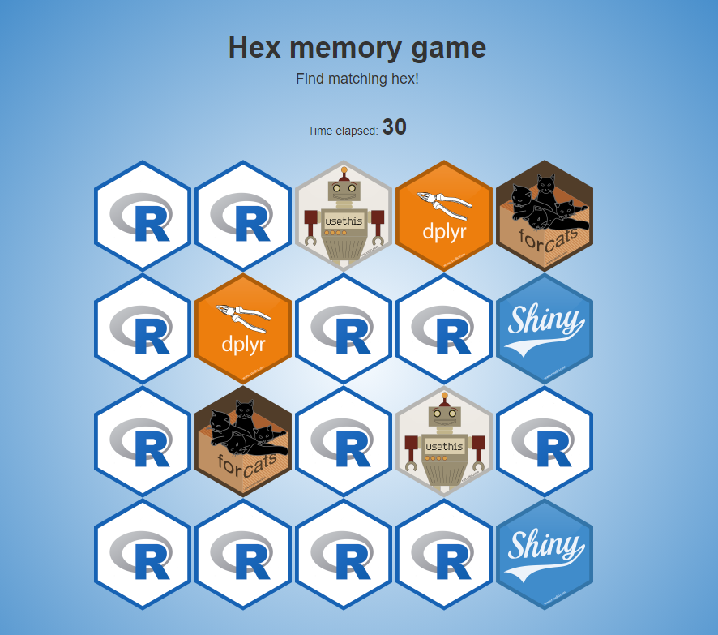

# Hex Memory Game

A [Shiny](https://github.com/rstudio/shiny) app to find all matching hex as soon as possible!

This application is our submission to the RStudio Shiny contest: https://community.rstudio.com/t/shiny-contest-submission-hex-memory-game/25336

Currently we use only [RStudio hex stickers](https://github.com/rstudio/hex-stickers), but you can clone the repo and put any hex you want into `www/hex/` directory.

To run the application locally (faster than online version below) use:

```r
shiny::runGitHub(repo = "dreamRs/memory-hex")
```

An online version is available here: http://shinyapps.dreamrs.fr/memory-hex/ or here : https://dreamrs.shinyapps.io/memory-hex/



